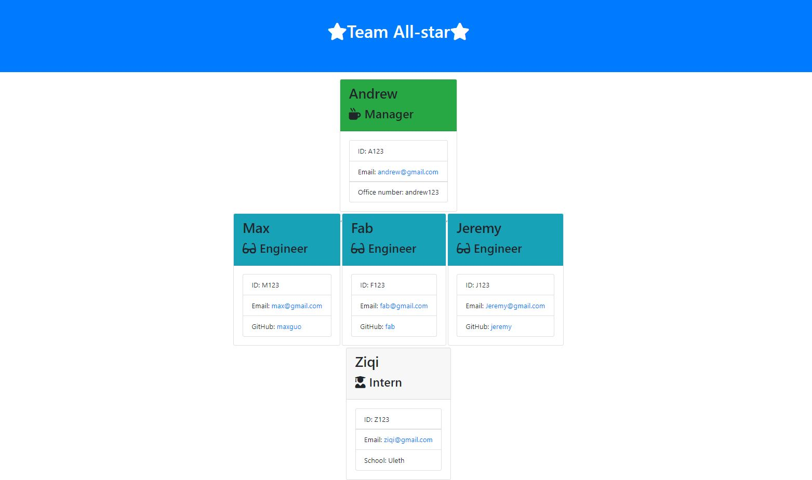

# Template Engine - Employee Summary

## Badges


## License

Copyright 2020 - Max Guo. Code released under the MIT license.

## User Story
```
As a manager
I want to generate a webpage that displays my team's basic info
so that I have quick access to emails and GitHub profiles
```

## Table of Content

* [Description](#Description)
* [Demo](#Demo)
* [Contributing](#Contributing)
* [Tests](#Tests)

## Description

The application will prompt the user for information about the team manager and then information about the team members. The user can input any number of team members, and they may be a mix of engineers and interns.

After user enter all the required informations, there will be a html file generated to the .output folder called team.html

The team.html file will display every team member's information

## Demo



## Contributing

Max, github:https://github.com/Maxguojiaq

## Tests

Tests uses Jest testing framework
See detailed tests under folder '/test'


    